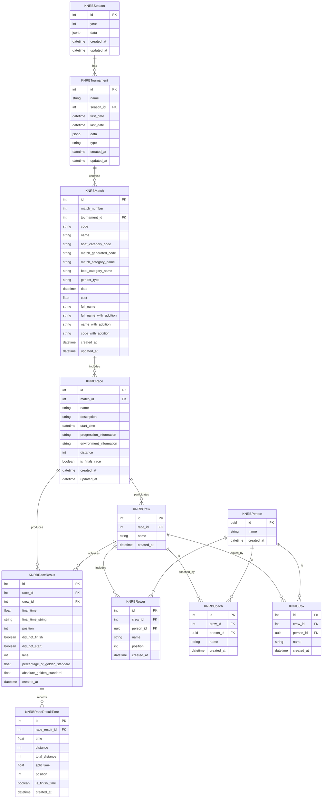

```mermaid

erDiagram
    KNRBSeason {
        int id PK
        int year
        jsonb data
        datetime created_at
        datetime updated_at
    }

    KNRBTournament {
        int id PK
        string name
        int season_id FK
        datetime first_date
        datetime last_date
        jsonb data
        string type
        datetime created_at
        datetime updated_at
    }

    KNRBMatch {
        int id PK
        int match_number
        int tournament_id FK
        string code
        string name
        string boat_category_code
        string match_generated_code
        string match_category_name
        string boat_category_name
        string gender_type
        datetime date
        float cost
        string full_name
        string full_name_with_addition
        string name_with_addition
        string code_with_addition
        datetime created_at
        datetime updated_at
    }

    KNRBRace {
        int id PK
        int match_id FK
        string name
        string description
        datetime start_time
        string progression_information
        string environment_information
        int distance
        boolean is_finals_race
        datetime created_at
        datetime updated_at
    }

    KNRBCrew {
        int id PK
        int race_id FK
        string name
        datetime created_at
    }

    KNRBRaceResult {
        int id PK
        int race_id FK
        int crew_id FK
        float final_time
        string final_time_string
        int position
        boolean did_not_finish
        boolean did_not_start
        int lane
        float percentage_of_golden_standard
        float absolute_golden_standard
        datetime created_at
    }

    KNRBRaceResultTime {
        int id PK
        int race_result_id FK
        float time
        int distance
        int total_distance
        float split_time
        int position
        boolean is_finish_time
        datetime created_at
    }

    KNRBPerson {
        uuid id PK
        string name
        datetime created_at
    }

    KNRBRower {
        int id PK
        int crew_id FK
        uuid person_id FK
        string name
        int position
        datetime created_at
    }

    KNRBCoach {
        int id PK
        int crew_id FK
        uuid person_id FK
        string name
        datetime created_at
    }

    KNRBCox {
        int id PK
        int crew_id FK
        uuid person_id FK
        string name
        datetime created_at
    }

    %% Relationships
    KNRBSeason ||--o{ KNRBTournament : has
    KNRBTournament ||--o{ KNRBMatch : contains
    KNRBMatch ||--o{ KNRBRace : includes
    KNRBRace ||--o{ KNRBCrew : participates
    KNRBRace ||--o{ KNRBRaceResult : produces
    KNRBCrew ||--o{ KNRBRaceResult : achieves
    KNRBRaceResult ||--o{ KNRBRaceResultTime : records
    KNRBCrew ||--o{ KNRBRower : includes
    KNRBCrew ||--o{ KNRBCoach : coached_by
    KNRBCrew ||--o{ KNRBCox : coxed_by
    KNRBPerson ||--o{ KNRBRower : is
    KNRBPerson ||--o{ KNRBCoach : is
    KNRBPerson ||--o{ KNRBCox : is
```